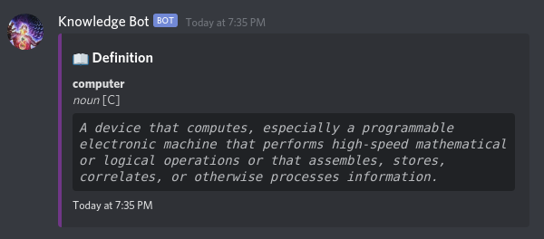

# Knowledge Bot

## :book: Description

Self hosted discord bot that offers translation and dictionary utilities.

### :dart: Features

- Text translation
- Language detection
- Definitions, synonyms, antonyms and rhymes
- Word of the day and random words

### :high_brightness: Visuals



## :bulb: Getting Started

Follow the instructions below to work on the project on your local environment.

### :clipboard: Prerequisites

In case you don't use Docker, you'll need Git, Python 3.8 and a Virtual Environment (in this case, Pipenv is used as a package manager and virtual environment).

All dependencies are listed on the Pipfile.

### :computer: Installation

```
# Clone this repository
$ git clone https://github.com/miguel-osuna/Knowledge-Bot.git

# Go into the repository from the terminal
$ cd Knowledge-Bot

# Remove current origin repository
$ git remote remove origin
```

## :whale: Running project with Docker

This will run the project on your local environment.

Make sure to create a hidden folder like `envs.example` named `.envs`, with the same kind of environment variables.

```
docker-compose up -d --build
```

## :rocket: Deployment

This project includes a Procfile for Heroku, but can be deployed to any other host.

- Heroku: read the [following tutorial](https://devcenter.heroku.com/articles/getting-started-with-python) to learn how to deploy to your heroku account..

## :wrench: Built With

- [discord.py](https://discordpy.readthedocs.io/en/latest/) - Python Library for Discord API
- [Google Cloud Translation](https://cloud.google.com/translate)

## Project Documentation

To learn about bot commands, check the [project documentation](#)

## :performing_arts: Authors

- **Miguel Osuna** - https://github.com/miguel-osuna

## :ledger: License

This project is licensed under the MIT License - see the LICENSE.md file for details.
